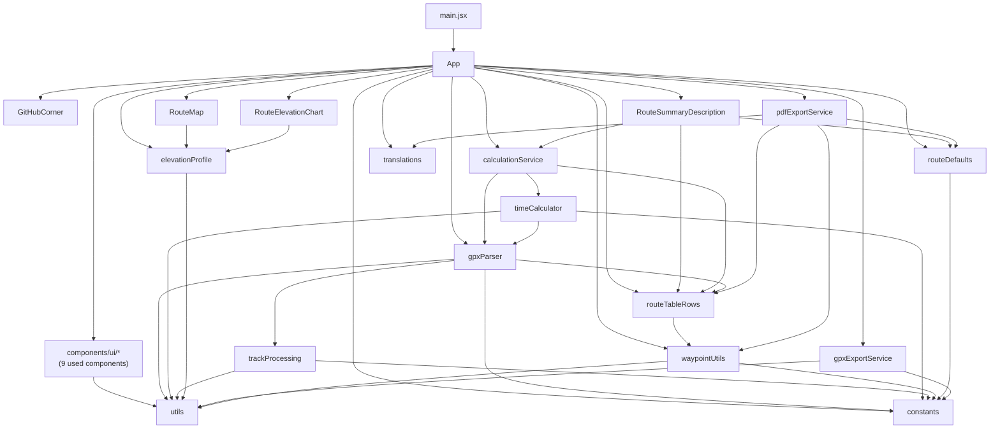

# Architecture

Simple map of how source files depend on each other. Arrows mean “imports / calls”. Unused shadcn components and test files are omitted.

## Dependency flowchart

**Typical GPX import path:** `App` → `calculationService` → `gpxParser` (geometry) + `timeCalculator` (times) + `routeTableRows` (normalize waypoints).

**Note:** `timeCalculator` calls `gpxParser.getTrackPathBetweenWaypoints` for the Swiss alpine club model. Import is one-way (no cycle).

---

## GPX processing pipeline

Raw GPX content is always kept in `route.gpxContent` (unchanged on disk / in storage).

On every parse (`gpxParser.parseGPXGeometry`):

1. **Track pre-processing** (`trackProcessing.processTrackPoints`) — resample, elevation smooth, deadband. Runs before distance or time logic, for all routes with a track.
2. **Processed track downstream** — stored as `route.processedTrackPoints` and as `route.gpxData.tracks[0].points`. Used for distance metrics, map polyline, elevation profile, and Swiss-model timing.
3. **Distance calculation** (route setting) — `track` matches GPX waypoints to track segments; `waypoint-to-waypoint` uses a simpler waypoint ordering path. Both use the pre-processed polyline where a track is needed.
4. **Time calculation** (route setting):
   - **Naismith upgraded** — uses each leg’s aggregated `segmentDistance`, `segmentAscent`, `segmentDescent` from the table.
   - **Swiss alpine club** — slices the pre-processed track between consecutive waypoints (`getTrackPathBetweenWaypoints`), applies the blend formula point-to-point on each short step, and sums step times.

Route configuration UI order: **track pre-processing** → **distance calculation** → **time calculation**.

---

## File roles

### Entry

**`main.jsx`**  
React entry point. Mounts `App` into the DOM.

**`App.jsx`**  
Main UI shell: route list, settings panels (including track pre-processing), waypoint table, file upload, exports, and localStorage persistence. Orchestrates everything the user sees.

---

### Feature components

**`components/GitHubCorner.jsx`**  
Small “report issues” link in the page corner. No app logic.

**`components/RouteMap.jsx`**  
Leaflet map: track polyline, waypoint markers, fit-to-track control. Track line comes from `elevationProfile.getRouteTrackPoints` (pre-processed track when available).

**`components/RouteElevationChart.jsx`**  
Elevation profile chart (Recharts). Pulls chart data from `elevationProfile.js`.

**`components/RouteSummaryDescription.jsx`**  
Route stats line (distance, ascent, time, etc.) shown under the route title.

**`components/ui/*` (9 used)**  
shadcn primitives: button, input, textarea, card, table, tooltip, alert-dialog, checkbox, badge. Styling only; most others in this folder are unused.

---

### Settings & constants

**`lib/constants.js`**  
Single source of default values: proximity thresholds, speeds per activity, time-calculation methods, track pre-processing params, column visibility defaults, etc.

**`lib/routeDefaults.js`**  
Builds and merges settings objects: new-route defaults, effective settings for saved routes (fills missing fields), column/map visibility, `localStorage` app preferences.

**`lib/translations.js`**  
All UI strings (EN, FR, ES, CA).

**`lib/utils.js`**  
Shared helpers: Tailwind `cn()` for shadcn/`App`, and haversine distance (`calculateDistance` in km, `calculateDistanceMeters`). Used by geometry, map-related code, and exports.

---

### GPX & geometry

**`lib/gpxParser.js`**  
Parses GPX files (via `@we-gold/gpxjs`), runs track pre-processing, matches waypoints to the track, computes segment distances and ascent/descent. Exposes `parseGPXGeometry`, `getTrackPathBetweenWaypoints`, and geometry recalculation helpers.

**`lib/trackProcessing.js`**  
Track pre-processing: resample by distance, median elevation smooth, cumulative deadband. Output is the polyline used everywhere downstream.

**`lib/elevationProfile.js`**  
Builds distance/elevation series for the chart. Exports `getRouteTrackPoints` (pre-processed track preferred, raw track fallback) — shared with `RouteMap` and waypoint snapping in `App`.

---

### Time & table

**`lib/timeCalculator.js`**  
Segment and total hiking times. **Naismith upgraded:** additive flat + ascent + descent on leg totals. **Swiss alpine club:** point-to-point blend along the processed track between waypoints (fallback: aggregated leg formula if no track). Formats times for display.

**`lib/calculationService.js`**  
Thin orchestrator: parse GPX → geometry (`gpxParser`) → times (`timeCalculator`) → normalized waypoints (`routeTableRows`). Re-exports common helpers for `App`.

**`lib/routeTableRows.js`**  
Table row model: rests, progression %, arrival times, end-of-route timing. Normalizes waypoint arrays.

**`lib/waypointUtils.js`**  
Display helpers: waypoint labels, leg descriptions (origin → destination), coordinate proximity checks.

---

### Export

**`lib/pdfExportService.js`**  
Generates the printable route PDF (table, summary, optional map/elevation).

**`lib/gpxExportService.js`**  
Exports route back to GPX and detects whether waypoints were modified since import. Track in export uses `gpxData` (pre-processed when parsing used track mode).

---

## Not shown

| Item | Why omitted |
|------|-------------|
| `src/components/ui/*` (37 files) | Installed but not imported from `App` |
| `src/**/*.test.js` | Tests mirror lib imports; not part of runtime |
| `src/types.js` | Not imported |
| `src/hooks/use-mobile.js` | Only used by unused `sidebar.jsx` |
| npm packages | External deps (React, Leaflet, jsPDF, etc.) |
