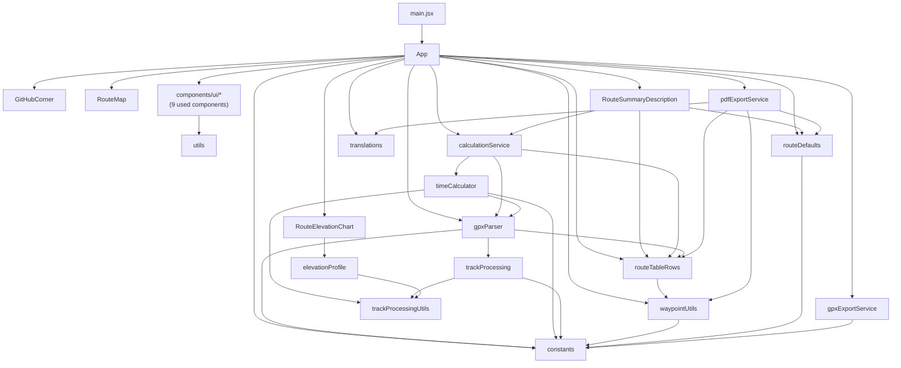

# Architecture

Simple map of how source files depend on each other. Arrows mean “imports / calls”. Unused shadcn components and test files are omitted.

## Dependency flowchart

**Typical GPX import path:** `App` → `calculationService` → `gpxParser` (geometry) + `timeCalculator` (times) + `routeTableRows` (normalize waypoints).

**Note:** `timeCalculator` reads track segments from `gpxParser` for track-based time models. Import is one-way (no cycle).

---

## File roles

### Entry

**`main.jsx`**  
React entry point. Mounts `App` into the DOM.

**`App.jsx`**  
Main UI shell: route list, settings panels, waypoint table, file upload, exports, and localStorage persistence. Orchestrates everything the user sees.

---

### Feature components

**`components/GitHubCorner.jsx`**  
Small “report issues” link in the page corner. No app logic.

**`components/RouteMap.jsx`**  
Leaflet map: track polyline, waypoint markers, fit-to-track control.

**`components/RouteElevationChart.jsx`**  
Elevation profile chart (Recharts). Pulls chart data from `elevationProfile.js`.

**`components/RouteSummaryDescription.jsx`**  
Route stats line (distance, ascent, time, etc.) shown under the route title.

**`components/ui/*` (9 used)**  
shadcn primitives: button, input, textarea, card, table, tooltip, alert-dialog, checkbox, badge. Styling only; most others in this folder are unused.

---

### Settings & constants

**`lib/constants.js`**  
Single source of default values: proximity thresholds, speeds per activity, time-calculation methods, track-processing params, column visibility defaults, etc.

**`lib/routeDefaults.js`**  
Builds and merges settings objects: new-route defaults, effective settings for saved routes (fills missing fields), column/map visibility, `localStorage` app preferences.

**`lib/translations.js`**  
All UI strings (EN, FR, ES, CA).

**`lib/utils.js`**  
`cn()` helper for Tailwind class merging. Used by shadcn components and `App`.

---

### GPX & geometry

**`lib/gpxParser.js`**  
Parses GPX files (via `@we-gold/gpxjs`), matches waypoints to the track, computes segment distances and ascent/descent. Exposes geometry-only parsing and track path helpers.

**`lib/trackProcessing.js`**  
Preprocesses raw track points: resample, smooth elevation, deadband. Used before distance calculations on the track.

**`lib/trackProcessingUtils.js`**  
Low-level geo math (haversine distance). Shared by track processing, time calculator, and elevation profile.

**`lib/elevationProfile.js`**  
Builds distance/elevation series for the elevation chart.

---

### Time & table

**`lib/timeCalculator.js`**  
Segment and total hiking times (Naismith upgraded, Swiss alpine club blend). Formats times for display.

**`lib/calculationService.js`**  
Thin orchestrator: parse GPX → geometry (`gpxParser`) → times (`timeCalculator`) → normalized waypoints (`routeTableRows`). Re-exports common helpers for `App`.

**`lib/routeTableRows.js`**  
Table row model: rests, progression %, arrival times, end-of-route timing. Normalizes waypoint arrays.

**`lib/waypointUtils.js`**  
Display helpers: waypoint labels, leg descriptions (origin → destination), coordinate proximity checks.

---

### Export

**`lib/pdfExportService.js`**  
Generates the printable route PDF (table, summary, optional map/elevation).

**`lib/gpxExportService.js`**  
Exports route back to GPX and detects whether waypoints were modified since import.

---

## Not shown

| Item | Why omitted |
|------|-------------|
| `src/components/ui/*` (37 files) | Installed but not imported from `App` |
| `src/**/*.test.js` | Tests mirror lib imports; not part of runtime |
| `src/types.js` | Not imported |
| `src/hooks/use-mobile.js` | Only used by unused `sidebar.jsx` |
| npm packages | External deps (React, Leaflet, jsPDF, etc.) |
